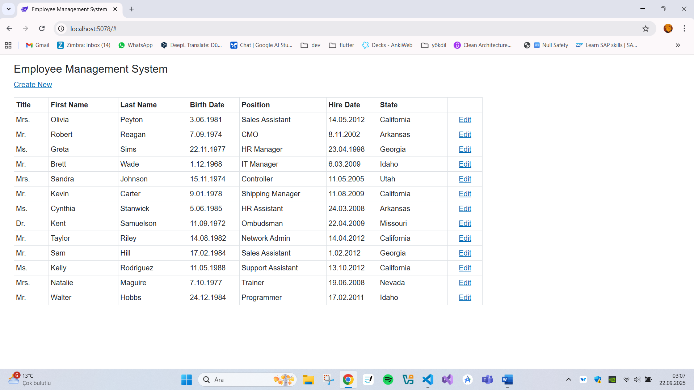
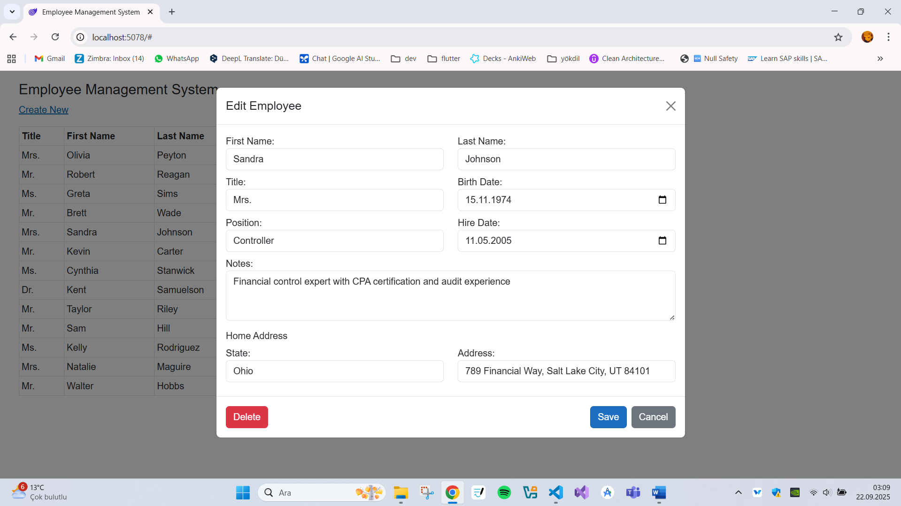

# Employee Management System

Bu proje, ASP.NET Core 8.0 ve Blazor Server kullanılarak geliştirilmiş bir çalışan yönetim sistemidir. Entity Framework Core ile SQL Server veritabanı entegrasyonu sağlar.

## 🎬 Demo

<!-- Video Demo -->
https://github.com/user-attachments/assets/your-video-file.mp4

<!-- GIF Demo (Önerilen) -->


## 📸 Proje Görselleri

<div align="center">
  
### 🏠 Ana Sayfa - Çalışan Listesi


### ➕ Çalışan Ekleme Formu


### ✏️ Düzenleme Modalı


### 📋 Çalışan Detayları


### 📱 Responsive Tasarım - Mobile


</div>

## 🚀 Özellikler

- **Çalışan CRUD İşlemleri**: Çalışan ekleme, düzenleme, silme ve görüntüleme
- **Modern UI**: Responsive ve modern arayüz
- **Veri Doğrulama**: Form validasyonu ve veri bütünlüğü kontrolü
- **Entity Framework Core**: Code-First yaklaşımı ile veritabanı yönetimi
- **QuickGrid**: Hızlı ve etkili veri görüntüleme
- **Real-time Updates**: Blazor Server ile gerçek zamanlı güncellemeler

## 🛠️ Teknolojiler

- **Framework**: ASP.NET Core 8.0
- **UI Framework**: Blazor Server
- **ORM**: Entity Framework Core 9.0.9
- **Veritabanı**: SQL Server
- **UI Components**: MudBlazor 8.12.0
- **Data Grid**: QuickGrid with EntityFramework Adapter

## 📋 Önkoşullar

- [.NET 8.0 SDK](https://dotnet.microsoft.com/download/dotnet/8.0)
- [SQL Server](https://www.microsoft.com/sql-server) (LocalDB da kullanılabilir)
- [Visual Studio 2022](https://visualstudio.microsoft.com/) veya [Visual Studio Code](https://code.visualstudio.com/)

## ⚡ Kurulum

1. **Projeyi klonlayın:**
   ```bash
   git clone [repository-url]
   cd demo
   ```

2. **NuGet paketlerini yükleyin:**
   ```bash
   dotnet restore
   ```

3. **Veritabanı bağlantı stringini yapılandırın:**
   `appsettings.json` dosyasında `MyDbContext` connection string'ini güncelleyin:
   ```json
   {
     "ConnectionStrings": {
       "MyDbContext": "Server=(localdb)\\mssqllocaldb;Database=EmployeeDb;Trusted_Connection=True;MultipleActiveResultSets=true"
     }
   }
   ```

4. **Veritabanı migration'larını uygulayın:**
   ```bash
   dotnet ef database update
   ```

5. **Uygulamayı çalıştırın:**
   ```bash
   dotnet run
   ```

6. **Tarayıcıda açın:**
   `https://localhost:7xxx` veya `http://localhost:5xxx` adresine gidin

## 📁 Proje Yapısı

```
demo/
├── Components/           # Blazor bileşenleri
│   ├── Layout/          # Layout bileşenleri
│   └── Pages/           # Sayfa bileşenleri
│       └── EmployeePages/  # Çalışan yönetimi sayfaları
├── Data/                # Veritabanı context
├── Models/              # Veri modelleri
├── Services/            # İş mantığı servisleri
├── Interfaces/          # Servis arayüzleri
├── Migrations/          # EF Core migration'ları
└── wwwroot/            # Statik dosyalar
```

## 🎯 Temel Kullanım

### Çalışan Modeli

Employee modeli aşağıdaki özellikleri içerir:

- **Id**: Benzersiz kimlik
- **Title**: Ünvan
- **FirstName**: Ad
- **LastName**: Soyad
- **BirthDate**: Doğum tarihi
- **Position**: Pozisyon
- **HireDate**: İşe giriş tarihi
- **State**: Eyalet
- **Notes**: Notlar (opsiyonel)
- **HomeAddress**: Ev adresi (opsiyonel)

### API Endpoints

Çalışan yönetimi için aşağıdaki sayfalar mevcuttur:

- `/employees` - Çalışan listesi
- `/employees/create` - Yeni çalışan ekleme
- `/employees/edit/{id}` - Çalışan düzenleme
- `/employees/details/{id}` - Çalışan detayları
- `/employees/delete/{id}` - Çalışan silme

## 🔧 Yapılandırma

### Veritabanı Yapılandırması

Veritabanı bağlantısı `Program.cs` dosyasında yapılandırılır:

```csharp
builder.Services.AddDbContextFactory<MyDbContext>(options =>
    options.UseSqlServer(builder.Configuration.GetConnectionString("MyDbContext")));
```

### Servis Kayıtları

- `IEmployeeService` - Çalışan işlemleri için servis
- `QuickGridEntityFrameworkAdapter` - Hızlı grid görüntüleme
- Database Developer Page Exception Filter - Geliştirme ortamında hata ayıklama

## 📊 Veritabanı Migration'ları

Proje şu migration'ları içerir:

- `firstMigration` - İlk veritabanı yapısı
- `secondMigration` - Güncelleme migration'ı

Yeni migration oluşturmak için:
```bash
dotnet ef migrations add MigrationName
dotnet ef database update
```

## 🤝 Katkıda Bulunma

1. Fork edin
2. Feature branch oluşturun (`git checkout -b feature/YeniOzellik`)
3. Değişikliklerinizi commit edin (`git commit -am 'Yeni özellik eklendi'`)
4. Branch'inizi push edin (`git push origin feature/YeniOzellik`)
5. Pull Request oluşturun

## 📝 Lisans

Bu proje MIT lisansı altında lisanslanmıştır.

